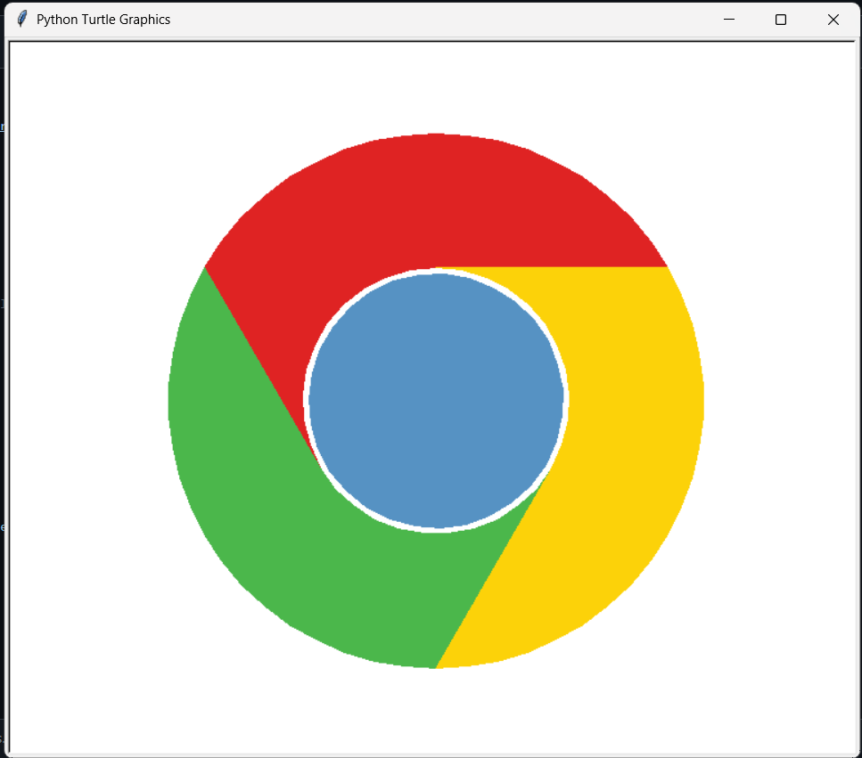

# 🐢 Turtle Google Logo

This is a **simple Google Chrome logo** created entirely using Python's `turtle` graphics library.  
I built this project **years ago** as a fun experiment to practice geometry, arcs, and turtle graphics.  

⚠️ **Note:**  
This is an **old project** uploaded for **fun and learning purposes**.

---

## ✨ Features
- Draws a complete **Google Chrome logo** using only code
- Uses `turtle` graphics and geometry

---

## 🛠️ Technologies
- Python 3.x  
- [turtle](https://docs.python.org/3/library/turtle.html) (built-in)
- `time` (built-in)

---

## 📂 How to Run
### 1️⃣ Clone the repo:
   ```bash
   git clone https://github.com/Arsalan692/Turtle-Google-Logo
   ```
### 2️⃣ Run the script:
   ```bash
   python google_logo.py
   ```

---
## 📸 Demo Screenshot
<p align="center">
  
</p>


